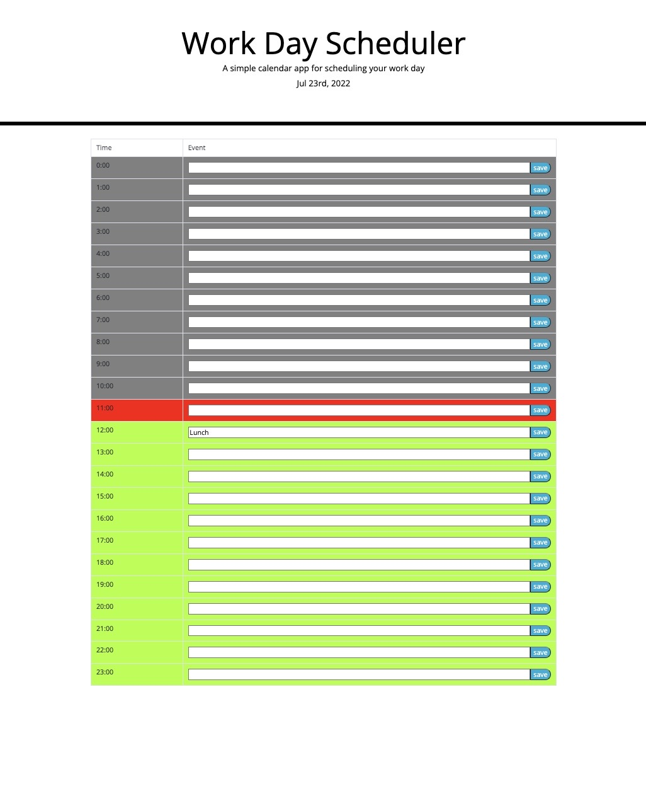

# Work Day Scheduler Starter Code

This project is a daily planner that dynamically changed according to the time of day. Users are presented with a table which includes a save button that will store event details to local storage. 

## Acceptance Criteria

* uses a data utility library to work with date and time

* current day is displayed at the top of the calendar

* timeblocks for the day are color coded to indicate whether it is past, present or future

* events can be saved to local storage and the saved event stays on the page after refreshing. 

The following image demonstrates the web application's appearance and functionality:

Website URL: https://acorbridg.github.io/WorkDayScheduler_AC/